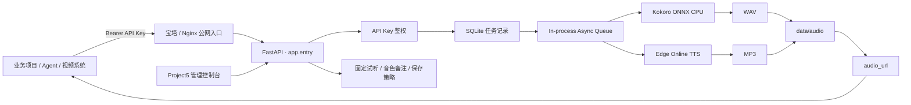
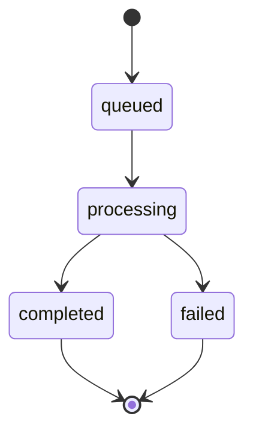

# Project5 · 双引擎 TTS API 服务平台

> 将 TTS 从业务项目中解耦，沉淀为一套可独立部署、统一鉴权、异步生成、可观测、可维护、可被 AI/Agent 直接接入的语音基础服务。

<p align="center">
  <strong>Kokoro 本地 CPU · Edge 在线 TTS · FastAPI · SQLite · 异步任务 · API Key · 管理控制台 · 宝塔自动部署</strong>
</p>

---

## 项目状态

**Project5 已从“模型测试脚本”完成到“可复用 TTS 服务”的工程化落地。**

目前仓库已经包含：双引擎 TTS、统一 API、异步任务、API Key 管理、后台控制台、音色库、固定试听、音色备注、音频保存策略、部署脚本、运行版本校验、CI 自检、小白 API 教程以及可直接复制给 AI 的接入上下文。

当前部署入口配置为：

```text
http://186.244.245.177:28442
```

常用地址：

| 用途 | 地址 |
|---|---|
| Project5 控制台 | `http://186.244.245.177:28442/` |
| 健康检查 | `http://186.244.245.177:28442/health` |
| 运行状态 | `http://186.244.245.177:28442/runtime` |
| 生成语音 | `POST http://186.244.245.177:28442/v1/audio/speech` |
| Edge 音色 | `GET http://186.244.245.177:28442/v1/voices?engine=edge` |
| Kokoro 音色 | `GET http://186.244.245.177:28442/v1/voices?engine=kokoro` |

> 如果以后迁移到正式域名，只需要替换 `PROJECT5_BASE_URL`，`/v1/...` 接口路径不需要变化。

---

## 目录

- [1. 项目定位](#1-项目定位)
- [2. 为什么要做 Project5](#2-为什么要做-project5)
- [3. 核心能力](#3-核心能力)
- [4. 系统架构](#4-系统架构)
- [5. 双引擎设计](#5-双引擎设计)
- [6. 默认推荐音色 ETG1](#6-默认推荐音色-etg1)
- [7. API 调用模型](#7-api-调用模型)
- [8. 管理后台](#8-管理后台)
- [9. 数据与任务模型](#9-数据与任务模型)
- [10. 音频与固定试听策略](#10-音频与固定试听策略)
- [11. 安全设计](#11-安全设计)
- [12. 工程化开发流程](#12-工程化开发流程)
- [13. 部署架构](#13-部署架构)
- [14. 宝塔自动部署](#14-宝塔自动部署)
- [15. 本地运行与运维命令](#15-本地运行与运维命令)
- [16. CI / 自检策略](#16-ci--自检策略)
- [17. 项目目录](#17-项目目录)
- [18. 文档体系](#18-文档体系)
- [19. 如何接入其他项目](#19-如何接入其他项目)
- [20. 项目经验与工程原则](#20-项目经验与工程原则)

---

# 1. 项目定位

Project5 不是一个把 TTS 模型塞进每个业务项目的 Demo，而是一套 **独立 TTS 基础服务**。

业务项目只负责提供文字和业务参数，Project5 负责：

```text
文本输入
→ 鉴权
→ 创建任务
→ TTS 推理
→ 保存音频
→ 返回 audio_url
```

因此以后无论是：

- AI 视频生成系统
- 播客生成系统
- AI 客服
- Agent
- 知识库
- 课程生成
- 内容工作流
- 自动剪辑系统

都不需要重新安装 Kokoro / Edge 的内部实现，只需要通过 HTTP API 调用 Project5。

一句话：

> **Project5 = 可以被其他项目复用的统一语音生成服务。**

---

# 2. 为什么要做 Project5

很多 AI 项目在早期会把 OCR、TTS、Embedding、RAG 等能力直接写进主项目。

短期看起来方便，项目变大以后会出现：

```text
业务代码
+ 模型代码
+ 模型文件
+ 推理依赖
+ 音色资源
+ 部署脚本
+ GPU/CPU 环境
= 一个越来越难维护的“大项目”
```

Project5 采用服务拆分方式：

```text
Project4 / 视频项目 / Agent
              │
              │ HTTP API
              ▼
           Project5
              │
      ┌───────┴────────┐
      │                │
  Kokoro CPU        Edge Online
```

这样可以获得几个非常实际的收益：

| 目标 | Project5 的处理方式 |
|---|---|
| 降低业务项目复杂度 | TTS 独立部署，不复制模型代码 |
| 多项目复用 | 一个 API 服务供多个业务调用 |
| 统一权限 | API Key 统一管理 |
| 统一音色 | 音色库集中维护 |
| 统一日志 | 调用、任务、错误集中记录 |
| 统一部署 | 宝塔 + Git Webhook 独立发布 |
| 独立扩展 | 后续换模型不需要改所有业务项目 |

---

# 3. 核心能力

## 3.1 双 TTS 引擎

Project5 当前提供两个正式引擎：

| 引擎 | 模式 | 输出 | 主要用途 |
|---|---|---|---|
| **Kokoro** | 本地 CPU ONNX 推理 | WAV | 本地生成、103 个中文音色、中英混读 |
| **Edge** | Microsoft Edge 在线 TTS | MP3 | 默认业务接入、速度快、普通话/台湾/粤语等音色 |

两个引擎使用 **同一套 API、同一套 API Key、同一套任务系统**。

## 3.2 异步任务

`POST /v1/audio/speech` 不会让客户端一直卡住等待音频。

它会：

```text
接收请求
→ HTTP 202
→ 返回 task_id
→ 后台生成
→ 客户端轮询
→ completed
→ audio_url
```

这样更适合真实业务系统和长文本生成。

## 3.3 API Key

后台支持：

- 创建 Key
- 完整 Key 创建后立即复制
- 启用 / 停用
- 删除
- 调用次数统计
- 最近使用时间
- Key 前缀识别

服务端只保存 Key 的哈希，不保存完整明文。

## 3.4 管理控制台

控制台覆盖日常运营需要：

- 工作台统计
- Kokoro 生成 / 试听
- Edge 生成 / 试听
- API 密钥
- 生成任务
- 音频文件
- 音色库
- 固定试听
- 音色备注
- 音频保存策略
- API 小白教程
- 一键复制给 AI 的接入上下文

## 3.5 音色资产

Kokoro 内置 **103 个中文音色**；Edge 当前维护 **14 个中文区域音色**。

后台音色库支持：

```text
搜索
试听
单独生成试听
批量生成试听
记录备注
复制 voice ID
分页管理
```

---

# 4. 系统架构



架构边界非常明确：

```text
Nginx       = 公网入口
FastAPI     = API / 管理后台 / 任务编排
SQLite      = Key / 任务 / 日志 / 设置
Kokoro      = 本地 CPU TTS
Edge        = 在线 TTS
文件系统    = WAV / MP3 / 固定试听
```

---

# 5. 双引擎设计

## Kokoro

底层采用：

```text
hexgrad/Kokoro-82M-v1.1-zh
kokoro-onnx
ONNX Runtime CPU
FP32 model
```

当前 CPU 服务器使用 FP32 ONNX 模型，并支持配置多线程推理。

Kokoro 中英混读专门做了语言前端处理：

```text
中文 → Misaki ZHG2P
英文 → Misaki English G2P
OOV → eSpeak fallback
中英边界 → soft-join
```

此外对常见 AI 技术词做了文本归一化，例如：

```text
ChatGPT
OpenAI
LangChain
LangGraph
API / RAG / MCP 等缩写
```

目标是减少中文切到英文时出现不自然的停顿。

## Edge

Edge 通过 `edge-tts` 使用在线语音服务。

特点：

- 不需要本地模型包
- 返回 MP3
- 生成速度通常更快
- 需要服务器具备公网访问能力
- 内置失败重试

---

# 6. 默认推荐音色 ETG1

业务项目如果没有明确指定其他声音，推荐优先使用：

```text
记忆名：ETG1
engine：edge
voice：zh-TW-YunJheNeural
显示名：Edge 云哲 · 台湾男声
speed：1.10
```

**注意：ETG1 只是 Project5 内部方便记忆的推荐名称，不是 API 的 voice 参数。**

API 应显式发送：

```json
{
  "engine": "edge",
  "voice": "zh-TW-YunJheNeural",
  "speed": 1.10
}
```

建议业务侧始终显式传 `engine / voice / speed`，这样不会因为未来服务端默认值变化而影响生成效果。

---

# 7. API 调用模型

## 7.1 环境变量

业务项目建议配置：

```env
PROJECT5_BASE_URL=http://186.244.245.177:28442
PROJECT5_API_KEY=YOUR_API_KEY
```

API Key 必须保存在服务端环境变量中，不要直接写进浏览器前端。

## 7.2 提交任务

```http
POST /v1/audio/speech
Authorization: Bearer YOUR_API_KEY
Content-Type: application/json
```

推荐请求：

```json
{
  "input": "你好，这是 Project5 TTS API。",
  "engine": "edge",
  "voice": "zh-TW-YunJheNeural",
  "speed": 1.10
}
```

成功后返回 HTTP `202 Accepted`：

```json
{
  "id": "tts_20260907_xxxxxxxxxx",
  "status": "queued",
  "engine": "edge",
  "voice": "zh-TW-YunJheNeural",
  "task_url": "http://186.244.245.177:28442/v1/tasks/tts_20260907_xxxxxxxxxx"
}
```

## 7.3 查询任务

```http
GET /v1/tasks/{task_id}
Authorization: Bearer YOUR_API_KEY
```

状态机：



客户端处理规则：

```text
queued      → 等待后继续查询
processing  → 等待后继续查询
completed   → 读取 audio_url
failed      → 读取 error 并停止
```

同一个 API Key 只能查询由自己创建的公开 API 任务。

## 7.4 获取音色

```http
GET /v1/voices?engine=edge
GET /v1/voices?engine=kokoro
```

不要自己猜 voice ID，应该使用服务真实返回的 `id`。

完整小白教程见：**[API_DOCS.md](./API_DOCS.md)**。

---

# 8. 管理后台

Project5 控制台不是只用于“试一下声音”，而是整个 TTS 服务的管理端。

## 工作台

展示：

```text
今日调用
成功生成
失败数
生成字符数
可用 API Key
最近任务
引擎状态
```

## Kokoro / Edge 试听

每个引擎均支持：

- 输入文本生成
- 音色选择
- 语速设置
- 在线播放
- 音频下载
- 固定试听

## 音色库

每个音色可以：

```text
▶ 试听
生成试听
保存备注
复制 API voice ID
```

音色备注会持久化保存，方便以后记录：

```text
适合播客
偏成熟
英文自然
财经解说
温柔女声
```

## API 密钥

API Key 页面支持完整的生命周期管理。

创建 Key 时完整密钥只从服务端返回一次；后台服务端数据库只持久化哈希和 Key 前缀。

## 生成任务

任务记录包括：

```text
task_id
调用方
来源 IP
文本
engine
voice
speed
字符数
状态
错误
耗时
audio_filename
创建/完成时间
```

---

# 9. 数据与任务模型

Project5 使用 SQLite 保存核心运行状态。

主要数据表：

```text
api_keys
tts_tasks
api_logs
voice_notes
service_settings
```

任务队列本身在应用进程内运行，但任务状态先写入 SQLite。

服务启动时会：

- 恢复仍处于 `queued` 的任务
- 将服务重启时仍处于 `processing` 的任务标记为失败，避免永远卡死

因此这里采用的是：

> **SQLite 持久化任务状态 + 进程内异步队列**

而不是引入 Redis / RabbitMQ 等额外基础设施。

这非常适合当前单机 8 核 CPU 服务的复杂度和使用规模。

---

# 10. 音频与固定试听策略

Project5 把两类音频严格分开。

## 正式生成音频

位置：

```text
data/audio/
```

包括：

```text
Kokoro → .wav
Edge   → .mp3
```

管理员可以选择：

```text
手动管理
或
24 小时自动清理
```

24 小时清理只删除正式音频文件，任务历史仍保留。

因此业务项目如果需要永久保存，应该：

```text
completed
→ 获取 audio_url
→ 下载 / 转存到自己的长期存储
```

## 固定试听

位置：

```text
app/static/previews/
```

固定试听属于音色资产：

- 手动生成
- 可批量生成
- 可更新统一试听文案
- 可保留旧文案状态
- 不参与 24 小时正式音频清理

---

# 11. 安全设计

Project5 的安全边界主要分三层。

## 11.1 管理端与业务 API 分离

```text
管理员 → Admin Session / ADMIN_KEY
业务方 → Bearer API Key
```

业务 API Key 不能直接等同于后台管理员权限。

## 11.2 API Key 不明文落库

数据库保存：

```text
SHA-256(key)
key_prefix
状态
调用次数
创建时间
最后使用时间
```

完整 Key 创建后只由接口返回一次。

## 11.3 服务不直接暴露 Uvicorn

生产运行默认监听：

```text
127.0.0.1:8005
```

公网请求通过宝塔 / Nginx 进入。

安全建议：

- `.env` 永远不要提交 GitHub
- 不在 README / Issue / 日志中放真实 API Key
- 生产环境建议配置 HTTPS 正式域名
- 定期轮换长期使用的 API Key
- 不让业务前端浏览器直接持有高权限 Key

---

# 12. 工程化开发流程

Project5 的开发过程不再采用“改完代码就算完成”，而是按真实项目的生命周期拆分。


## 阶段 1：需求定义

先回答：

```text
这是业务功能，还是基础能力？
是否应该独立成服务？
调用者真正需要什么？
```

Project5 最终确定只负责 TTS，不负责视频、知识库或业务工作流。

## 阶段 2：架构设计

确定：

- FastAPI 统一入口
- TTS 双引擎适配层
- SQLite 状态持久化
- 异步任务模型
- API Key 鉴权
- 文件系统存储音频
- 原生 HTML/CSS/JS 控制台

## 阶段 3：开发

功能按模块拆分：

```text
app/main.py            → 基础 API / DB / Key / 任务
app/entry.py           → 双引擎正式入口
app/dual_tts.py        → 引擎抽象
app/tts.py             → Kokoro 推理
app/preview_admin.py   → 固定试听
app/voice_notes.py     → 音色备注 / 前端增强
app/audio_retention.py → 音频保存策略
```

## 阶段 4：验证

不仅验证“代码能跑”，还验证：

```text
Python 语法
JavaScript 语法
接口结构
双引擎存在
ETG1 文档默认值
固定试听
音色备注
24h 清理
部署脚本语法
运行版本标记
```

## 阶段 5：部署

部署时区分：

```text
代码更新
≠
运行进程更新
≠
公网入口更新
```

因此部署脚本会验证当前 Git commit 是否真正由当前运行进程提供。

## 阶段 6：复盘

部署故障不是继续无限增加脚本复杂度，而是：

```text
找到最后成功版本
→ 比较差异
→ 找到回归点
→ 恢复稳定职责边界
→ 写入文档
```

部署事故复盘已经沉淀到：

**[docs/baota-deploy-fix.html](./docs/baota-deploy-fix.html)**

---

# 13. 部署架构

当前部署模型：

```text
GitHub
  │
  │ push
  ▼
宝塔 Git 自动部署 / Webhook
  │
  │ git pull
  ▼
/www/wwwroot/project5
  │
  ├─ scripts/auto-deploy.sh
  │
  ▼
Uvicorn app.entry:app
127.0.0.1:8005
  │
  ▼
宝塔 / Nginx
公网 :28442
```

这里刻意不使用 Docker 作为必需条件。

当前单机环境只需要：

```text
Linux
Python 3.10+
venv
Nginx / 宝塔
CPU
公网网络（Edge TTS）
```

---

# 14. 宝塔自动部署

宝塔 Git 自动部署完成 `git pull` 后执行：

```bash
bash /www/wwwroot/project5/scripts/auto-deploy.sh
```

当前正常部署路径保持简单：

```text
Git 已同步
→ 释放旧 Project5 端口
→ 启动当前 commit
→ 验证当前前端 / commit
→ 后台修复依赖和模型资产
→ 双引擎真实生成自检
```

一个重要工程原则：

> **普通代码部署不再自动重写宝塔 / Nginx 配置。**

应用发布和服务器基础设施维护分离，避免一次普通代码更新因为 Nginx 配置冲突而被整体标记失败。

运行资产修复流程还会校验 Kokoro 模型和 103 音色包，发现音色包损坏时重新下载并做 ZIP/CRC 完整性校验。

---

# 15. 本地运行与运维命令

## 环境配置

参考：

```bash
cp .env.example .env
```

关键配置：

```env
PROJECT5_PORT=8005
KOKORO_THREADS=8
MAX_TEXT_LENGTH=5000
PRELOAD_MODEL=0
```

模型文件路径：

```env
KOKORO_ONNX_MODEL=/path/to/models/kokoro-v1.1-zh.onnx
KOKORO_ONNX_VOICES=/path/to/models/voices-v1.1-zh.bin
KOKORO_ONNX_CONFIG=/path/to/models/config.json
```

## 完整运行环境初始化

```bash
bash scripts/bootstrap-runtime.sh
```

脚本负责：

- 检测 Python 3.10+
- 创建 / 复用 `.venv`
- 安装依赖
- 下载 Kokoro FP32 ONNX
- 下载 103 音色包
- 下载 config
- 校验模型
- 启动服务
- 检查双引擎控制台
- 做真实 Kokoro + Edge 生成自检

## 启动

```bash
bash scripts/start.sh
```

## 停止

```bash
bash scripts/stop.sh
```

## 重启

```bash
bash scripts/restart.sh
```

## 日志

```bash
tail -f logs/app.log
```

## 健康检查

```bash
curl http://127.0.0.1:8005/health
```

## 运行状态

```bash
curl http://127.0.0.1:8005/runtime
```

---

# 16. CI / 自检策略

`.github/workflows/` 中维护多组自检工作流。

覆盖范围包括：

```text
Python syntax
JavaScript syntax
TTS wiring
Kokoro bilingual frontend
Edge integration
Console structure
Voice library
Manual preview
Audio retention
API beginner docs
ETG1 recommendation
BaoTa deployment routing
```

此外运行部署本身还有两层验证：

```text
第一层：start.sh
验证“当前进程是否真的提供当前 commit 的新前端”

第二层：bootstrap-runtime.sh
验证模型、音色包、Kokoro、Edge 和真实音频输出
```

这比“进程能启动”更严格。

---

# 17. 项目目录

```text
project5/
├── app/
│   ├── main.py                 # FastAPI 基础能力、SQLite、Key、任务、日志
│   ├── entry.py                # Project5 正式双引擎应用入口
│   ├── dual_tts.py             # Kokoro / Edge 引擎适配层
│   ├── tts.py                  # Kokoro ONNX + 中英 G2P
│   ├── preview_admin.py        # 固定试听后台能力
│   ├── voice_notes.py          # 音色备注 / 控制台扩展 / 版本信息
│   ├── audio_retention.py      # 正式音频 24h 保存策略
│   └── static/
│       ├── console-v2.html     # 双引擎管理控制台
│       ├── preview-admin.js    # 固定试听管理
│       ├── voice-library.js    # 音色库 / 批量试听 / 保存策略
│       ├── api-docs-beginner.js# 后台小白 API 文档
│       ├── api-guide-zh.html    # 独立小白教程页面
│       └── previews/            # 固定试听资产（运行时）
│
├── data/
│   ├── project5.db             # SQLite（运行时生成）
│   └── audio/                  # 正式 WAV / MP3（运行时生成）
│
├── models/                     # Kokoro 模型 / voices / config（部署生成）
├── logs/                       # 服务 / 部署 / selfcheck 日志
│
├── scripts/
│   ├── auto-deploy.sh          # 宝塔 Webhook 主部署入口
│   ├── bootstrap-runtime.sh    # 完整依赖/模型/真实生成自检
│   ├── repair-runtime-assets.sh# 音色包修复与部署衔接
│   ├── start.sh                # 启动并验证当前 commit
│   ├── stop.sh                 # 释放 Project5 进程/端口
│   └── restart.sh              # 重启
│
├── docs/
│   └── baota-deploy-fix.html   # 部署故障复盘知识 Artifact
│
├── .github/workflows/          # CI / 自检
├── .env.example                # 环境变量模板
├── requirements.txt            # Python 依赖
├── API_DOCS.md                 # 给人的中文小白 API 教程
├── AI_API_CONTEXT.md           # 直接复制给 AI 的接入上下文
└── README.md
```

运行时大文件、`.env`、数据库和用户生成音频不应该提交到公开 GitHub。

---

# 18. 文档体系

Project5 不只维护 README，而是把不同读者需要的文档拆开。

| 文档 | 面向谁 | 作用 |
|---|---|---|
| `README.md` | 开发者 / 面试官 / 项目维护者 | 了解整个项目、架构和工程流程 |
| `API_DOCS.md` | API 小白 | 从 0 理解 API 并完成第一次调用 |
| `AI_API_CONTEXT.md` | ChatGPT / Agent / 代码助手 | 复制后让 AI 直接接入 Project5 |
| `app/static/api-guide-zh.html` | 后台用户 | 可视化中文 API 教程 |
| `docs/baota-deploy-fix.html` | 运维 / 后续 AI | 复用宝塔部署问题的排查经验 |

这是 Project5 一个非常重要的交付设计：

> **既让人能看懂，也让 AI 能直接执行。**

---

# 19. 如何接入其他项目

最简单的方式不是让另一个项目复制 Project5 代码。

而是：

```text
1. 在 Project5 后台创建 API Key
2. 在业务项目增加 PROJECT5_BASE_URL
3. 在业务项目增加 PROJECT5_API_KEY
4. POST /v1/audio/speech
5. 保存 task_id
6. GET /v1/tasks/{task_id}
7. completed 后读取 audio_url
```

如果使用 AI 编程：

直接把 **[AI_API_CONTEXT.md](./AI_API_CONTEXT.md)** 完整复制给 AI。

这份上下文会要求 AI：

- 先检查目标项目的技术栈
- 不复制 TTS 模型代码
- 增加环境变量
- 封装 Project5 客户端
- 默认使用 ETG1 / 云哲台湾男声 / `1.10`
- 实现 202 → task_id → polling → audio_url
- 处理错误与超时
- 有条件时做真实端到端测试
- 最后汇报修改文件与测试结果

---

# 20. 项目经验与工程原则

Project5 最终沉淀了几条非常重要的工程经验。

### 1. 基础能力应该服务化

```text
不要把 TTS 模型复制到每一个业务项目。
```

让业务系统调用稳定 API，长期维护成本更低。

### 2. 代码更新不等于服务更新

```text
Git commit 最新
≠
当前运行进程最新
≠
公网入口最新
```

部署验证必须确认真正运行中的版本。

### 3. 部署脚本不要无限承担基础设施职责

普通应用发布只负责：

```text
代码
→ 进程
→ 服务验证
```

Nginx / 防火墙 / SSL 等基础设施配置应该独立维护。

### 4. API 应该围绕业务调用者设计

调用者不应该理解 Kokoro 内部如何加载 ONNX。

调用者只需要理解：

```text
input
engine
voice
speed
↓
task_id
↓
audio_url
```

### 5. 文档也是产品的一部分

Project5 同时维护：

```text
给开发者的 README
给小白的 API 教程
给 AI 的执行上下文
给运维的故障复盘
```

这让项目从“代码能跑”进一步变成“别人能接、AI 能接、未来自己还能维护”的工程资产。

---

## 技术栈

```text
Python 3.10+
FastAPI
Uvicorn
SQLite
Kokoro ONNX
ONNX Runtime CPU
Misaki Chinese / English G2P
espeak-ng fallback
Edge TTS
Mutagen
SoundFile
NumPy
Native HTML / CSS / JavaScript
BaoTa / Nginx
GitHub Actions
```

Project5 当前不强依赖：

```text
Docker
Redis
PostgreSQL
RabbitMQ
GPU
```

这使它能够在一台普通 CPU Linux 服务器上作为独立 TTS 基础服务运行。

---

## 最后

Project5 的价值不在于“又部署了一个 TTS 模型”。

它真正完成的是：

```text
模型能力
↓
稳定服务
↓
统一 API
↓
权限与任务
↓
后台运营
↓
自动部署
↓
质量验证
↓
文档与 AI 交接
↓
可被其他项目持续复用
```

**这就是 Project5 当前的产品定位：一个已经从实验脚本走向工程化服务的 TTS 基础模块。**
